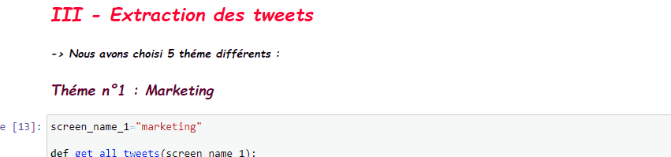
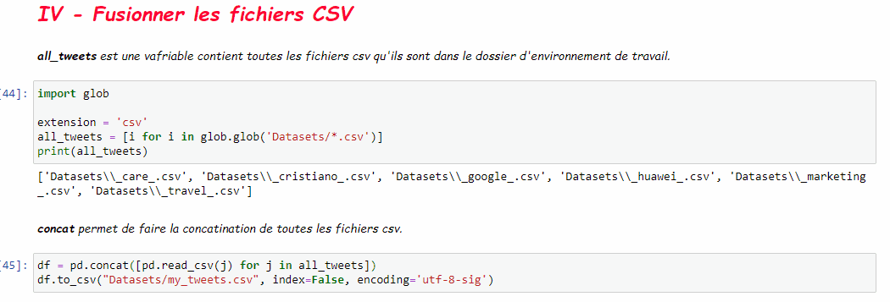
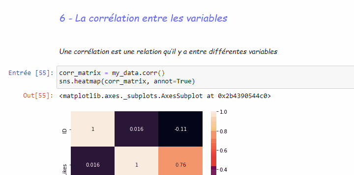
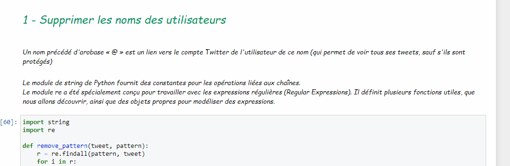
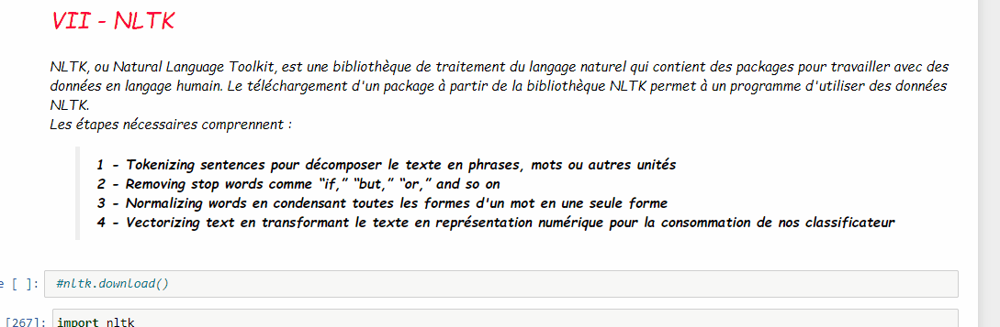
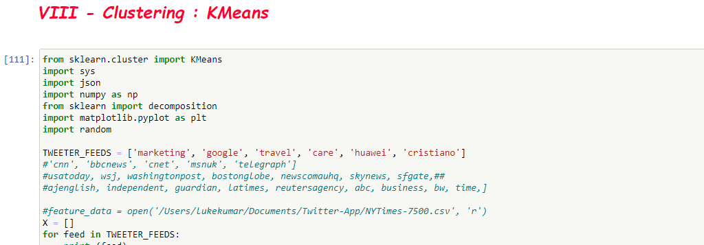
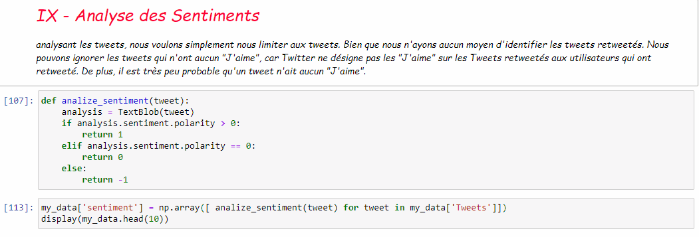
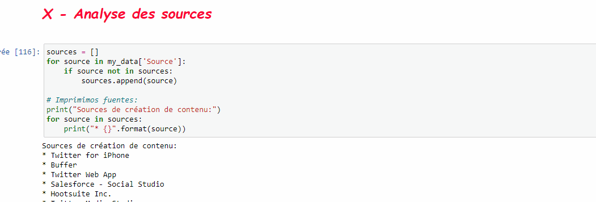

# Classification des Tweets

_**Hadhémi Gharbi**_ 
_**3 DNI Groupe 1**_

## Description du projet
Twitter est une mine d'or de données. Contrairement aux autres plates-formes sociales, presque tous les tweets des utilisateurs sont entièrement publics et extractibles. C'est un énorme avantage si vous essayez d'obtenir une grande quantité de données sur lesquelles exécuter des analyses. Les données Twitter sont également assez spécifiques. L'API de Twitter nous permet d'effectuer des requêtes complexes, comme extraire chaque tweet sur un certain sujet au cours des vingt dernières minutes, ou extraire les tweets non retweetés d'un certain utilisateur. 
Donc dans le projet nous allons extraire les tweets avec notre API pour analyser les mots avec la bibliothèque NLTK puis nous les regrouperons selon leur thème que nous avons choisi avec KMEANS

## Objectifs du projet
- _Maitriser l’API de twitter pour l’extraction des tweets _
- _Maitriser la partie NLP (natural language processing) avec NLTK en Python _
- _Appliquer les principes de nettoyage des données _
- _Classer les tweets : regrouper ensemble les tweets qui sont similaires._

## Plan du projet
### I - Importation des bibliothéques 
### II - Accéder à l'API Twitter 
### III - Extraction des tweets 
### IV - Fusionner les fichiers CSV 
### V - Data Preparation 
#### 1 - Chargement des données : Data Retrievel 
#### 2 - Les informations statistiques sur les données 
#### 3 - Les missings values 
#### 4 - Les types des donneés : Numériques ou Catégoriques 
#### 5 - Visualisation des histogrammes des variables numériques 
#### 6 - La corrélation entre les variables 
### VI -Prétraitement des tweets : Cleaning Data 
#### 1 - Supprimer les noms des utilisateurs 
#### 2 - Remplacer une expression 
### VII - NLTK 
#### 1 - Tokenization 
#### 2 - Stopwords & emotions & Punctiations 
#### 3 - Normalizing Words 
#### 4 - Vectorization 
### VIII - Clustering : KMeans 
### IX - Analyse des Sentiments 
### X - Analyse des sources 
### XI - Conclusion 

## I - Importation des bibliothéques
_1 - <b>La bibliothéque tweepy</b>: Tweepy prend en charge l'accès à Twitter via l'authentification de base et la nouvelle méthode, OAuth. Twitter a cessé d'accepter l'authentification de base, donc OAuth est désormais le seul moyen d'utiliser l'API Twitter._ 
Tweepy donne accès à l'API Twitter bien documentée. Avec tweepy, il est possible d'obtenir n'importe quel objet et d'utiliser n'importe quelle méthode proposée par l'API Twitter officielle. 
``pip install tweepy``
 
 
_2 - <b>La bibliothéque nltk</b>: Natural Language Toolkit (NLTK) est une boîte-à-outil permettant la création de programmes pour l'analyse de texte._ 
``pip install nltk``  
_La première chose à faire pour utiliser NLTK est de télécharger ce qui se nomme le NLTK corpora._ 
``import nltk`` 
``nltk.download()`` 
 
_Un corpus est défini de cette façon :_
 
Corpus, pluriel , corpora ; Une collection de données linguistiques, parfois une compilation de textes écrits, ou de transcriptions d'enregistrement de discours. La raison principale d'un corpus est de vérifier une hypothèse sur le langage - par exemple : déterminer comment l'utilisation d'un son particulier, d'un mot ou d'une construction syntaxique varie. Les corpus linguistiques agissent avec les lois et les pratiques d'utilisation de corpora dans l'étude du langage. Un corpus informatique contient un ensemble vaste de textes traduisibles en langage-machine.
 
Ainsi, un corpus est tout simplement un énorme ensemble de textes.
 
 
<b>"Stop Words"</b>
Parfois, nous avons besoin de "raboter" des éléments inutiles afin que les données soient davatange traduisibles pour l'ordinateur. En NLP, de telles données (des mots, words) sont qualifiées par stop words. Par conséquent, ces mots n'ont aucune signification pour nous, et nous souhaiterions les retirer.
 
La libraire NLTK contient quelques mots "d'arrêt" pour commencer ce traitement. Pour les connaître, écrivons ce petit script : 
``from nltk.corpus import stopwords`` 
Nous avons ainsi listé une collection non-ordonnée d'éléments, connu comme "mots d'arrêt", en langue anglaise, dans ce cas.
 
``from nltk.tokenize import word_tokenize`` 
_La "tokénisation", telle qu'il s'agit du processus consistant à briser un flux de texte en plusieurs mots, phrases, symboles ou tout autre élements significatifs dénommés Signes (tokens)._ 
la fonction ``word_tokenize()`` découpe de chaîne de signes selon la ponctuation, en dehors des points.

_ 3 - **La bibiliothéque Twython** est une bibliothèque Python offrant un moyen facile d'accéder aux données Twitter. _ 
``pip install twypthon`` 
 

_ 4 - **TextBlob** est une bibliothèque Python pour le traitement de données textuelles. Il fournit une API simple pour plonger dans les tâches courantes de traitement du langage naturel (PNL) telles que le marquage d'une partie du discours, l'extraction de phrases nominales, l'analyse des sentiments, la classification, la traduction, etc. _ 
``pip install textblob`` 
 

5 - **Le module re** fournit des modèles d'expressions régulières de style Perl. Les expressions régulières en Python nécessitent d'importer le module natif re. 
``pip install regex`` 
 

## II - Accéder à l'API Twitter

  
 

 
 

## III - Extraction des tweets
Nous avons choisi 5 thèmes différents : 
1- Marketing 
2- Travel 
3- Google 
4- Huawei 
5- Cars 
6- Cristiano Ronaldo 

Et pour chaque théme nous avons crée un fichier csv
 

## IV - Fusionner les fichiers CSV
Dans cette étape, nous avons regroupé tous les thèmes dans un seul fichier csv
 

## V - Data Preparation
Le terme « préparation des données » désigne les opérations de nettoyage et transformation qui doivent être appliqués aux données brutes avant leur traitement et analyse. Il s’agit d’une étape importante avant le traitement proprement dit, qui implique souvent de reformater et corriger les données et de combiner des datasets pour enrichir certaines données.
La première étape de la data preparation consiste à pouvoir accéder aux données de n’importe quelle source, quel qu’en soit l’origine, le récit ou le format.
 
 

### 1 - Chargement des données : Data Retrievel
Avec la commande ``pd.read_csv`` nous pouvons lire nos données.

### 2 - Les informations statistiques sur les données
Avec la commande ``.describe()`` nous pouvons faire des statistiques sur nos données

### 3 - Les missings values
Pour voir les valeurs manquantes qu'on a.

### 4 - Les types des donneés : Numériques ou Catégoriques
Connaître les types de nos données.
 
Les données numériques concernent des données représentées sous un format compatible avec un ordinateur. Un ordinateur ne peut traiter que des données numériques, puisqu'il fonctionne en mode binaire.
 
Une variable catégorique est une variable où chaque réponse peut être classée dans une catégorie particulière.
 

### 5 - Visualisation des histogrammes des variables numériques
Le but de la visualisation de données étant de représenter graphiquement des données brutes

### 6 - La corrélation entre les variables
Une corrélation est une relation qu’il y a entre différentes variables 
 

## VI -Prétraitement des tweets : Cleaning Data
### 1 - Supprimer les noms des utilisateurs
Un nom précédé d'arobase « @ » est un lien vers le compte Twitter de l'utilisateur de ce nom (qui permet de voir tous ses tweets, sauf s'ils sont protégés) 
Le module de string de Python fournit des constantes pour les opérations liées aux chaînes. 
Le module re a été spécialement conçu pour travailler avec les expressions régulières (Regular Expressions). Il définit plusieurs fonctions utiles, que nous allons découvrir, ainsi que des objets propres pour modéliser des expressions. 

### 2 - Remplacer une expression
Un mot précédé du signe « # » (croisillon) est un hashtag. Il s'agit d'un sujet attribué au message, Twitter peut afficher tous les tweets comportant un hashtag précis, et établit un classement des mots ou bien des hashtags du moment les plus utilisés. 
D'abord, on trouve un caractère accent circonflexe ^ qui veut dire qu'on cherche l'expression au début de la chaîne. Vous pouvez aussi voir, à la fin de la regex, le symbole $ qui veut dire que l'expression doit être à la fin de la chaîne. Si l'expression doit être au début et à la fin de la chaîne, cela signifie que la chaîne dans laquelle on recherche ne doit rien contenir d'autre que l'expression. 
Nous avons ensuite une classe de caractère [0-9]. Cela signifie qu'après le 0, on doit trouver un chiffre compris entre 0 et 9 (peut-être 0, peut-être 1, peut-être 2…).
 
Pour remplacer une partie d'une chaîne de caractères sur la base d'une regex, nous allons utiliser la fonction sub du module re. 
Elle prend trois paramètres : 
l'expression à rechercher ; 
par quoi remplacer cette expression ; 
la chaîne d'origine.
 

## VII - NLTK

#### Les étapes nécessaires comprennent
1 - Tokenizing sentences pour décomposer le texte en phrases, mots ou autres unités 
2 - Removing stop words like “if,” “but,” “or,” and so on 
3 - Normalizing words en condensant toutes les formes d'un mot en une seule forme 
4 - Vectorizing text en transformant le texte en représentation numérique pour la consommation de nos classificateur

 ### 1 - Tokenizing
 La tokenisation est le processus de décomposition de morceaux de texte en plus petits morceaux. spaCy est livré avec un pipeline de traitement par défaut qui commence par la tokenisation, ce qui rend ce processus un jeu d'enfant. Dans spaCy, vous pouvez effectuer soit une tokenisation de phrase, soit une tokenisation de mot: 
Word tokenization décompose le texte en mots individuels. 
Sentence tokenization décompose le texte en phrases individuelles. 

### 2 - Removing Stop Words
 
Stop Words sont des mots qui peuvent être importants dans la communication humaine mais qui ont peu de valeur pour les machines. spaCy est livré avec une liste par défaut de mots vides que vous pouvez personnaliser 

### 3 - Normalizing Words
 
La normalisation est un peu plus complexe que la tokenisation. Cela implique de condenser toutes les formes d'un mot en une seule représentation de ce mot.
 
 - Stemming 
 - Lemmatization
 
<b>Stemming</b> : un mot est coupé à sa racine, la plus petite unité de ce mot à partir de laquelle vous pouvez créer les mots descendants. Vous venez de voir un exemple de cela ci-dessus avec "montre". La racine tronque simplement la chaîne en utilisant des terminaisons communes, de sorte qu'elle manquera la relation entre «sentir» et «ressenti», par exemple.
 
<b>Lemmatization</b> : cherche à résoudre ce problème. Ce processus utilise une structure de données qui relie toutes les formes d'un mot à sa forme la plus simple, ou lemme. Parce que la lemmatisation est généralement plus puissante que la tige, c'est la seule stratégie de normalisation proposée par spaCy.

### 4 - Vectorizing Text
 
est un processus qui transforme un jeton en un vecteur, ou un tableau numérique qui, dans le contexte de la NLP, est unique et représente diverses caractéristiques d'un jeton. Les vecteurs sont utilisés sous le capot pour trouver des similitudes de mots, classer le texte et effectuer d'autres opérations NLP.

## VIII - Clustering : KMeans
C’est l’un des algorithmes de clustering les plus répandus. Il permet d’analyser un jeu de données caractérisées par un ensemble de descripteurs, afin de regrouper les données “similaires” en groupes (ou clusters).

## IX - Analyse des Sentiments
L’analyse du sentiment (ou de la tonalité), aussi appelé opinion mining, est une notion beaucoup évoquée mais souvent mal comprise.
 
Il s‘agit du processus qui permet de déterminer la tonalité émotionnelle qui se cache derrière une série de mots. Cette analyse est utilisée pour mieux comprendre la perception, les opinions et les émotions exprimées dans une mention en ligne.

## X - Analyse des sources

## XI - Conclusion
Dans ce projet, nous avons vu l'extraction de tweets et les analyser avec la bibliothèque nltk pour regrouper les thèmes que nous avons choisis.

## Références
[Watermark](https://github.com/rasbt/watermark)
 
[NLTK](https://code.tutsplus.com/fr/tutorials/introducing-the-natural-language-toolkit-nltk--cms-28620)
 
[Analyse des sentiments](https://stackabuse.com/python-for-nlp-sentiment-analysis-with-scikit-learn/)
 
[Cleaning Data](https://www.youtube.com/watch?v=KhXU7KOxQcg&ab_channel=UnfoldDataScience)
 

